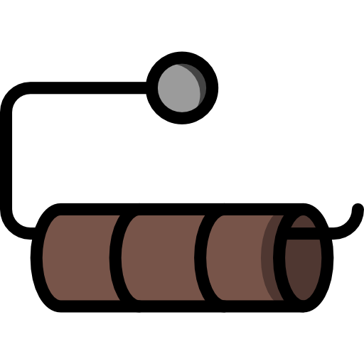

# Contributing

<b>English</b> · <a href="i18n/CONTRIBUTING.de.md">Deutsch</a>
<br /><br />

Thanks for taking the time. This project is small on purpose; a change that keeps it small is
usually the better change.

## Ground rules

1. **Tests belong to the change, not to the cleanup.** If you change behaviour, change a test in
   the same commit. Documentation and `CHANGELOG.md` move with it too.
2. **The suite must be repeatable.** It brings its own fresh state, needs no network, and cleans up.
   Run `./scripts/check.sh` twice — both runs green. A test that fails on the second run is broken,
   not the code.
3. **No personal names in the repository.** No private hostnames, no company domains, no customer
   names — not in code, sample data, tests, docs or commit messages. Use `example.com` and
   configure real values through environment variables. `tests/test_repo.py` enforces this.
4. **Secrets come from the environment.** `PAPERLESS_TOKEN` and `MISTRAL_KEY` are read from the
   environment; the config carries no credentials. Keep it that way.

## Workflow

Work on a feature branch. CI does not run there — `ci-local` (or `./scripts/check.sh`) is your
safety net. Open a pull request; CI runs on the PR and on `main`.

```bash
git switch -c my-change
git config core.hooksPath .githooks    # once per clone
# ... edit, then:
./scripts/check.sh
git commit -am "Describe the change, not the diff"
git push -u origin my-change
```

The classifier is standard-library only — no install step to contribute to `classify.py`. The panel
depends on FastAPI (`pip install -r panel/requirements.txt`) if you touch it.

## Style

- Comments explain **why**, never what the next line does. If a line needs a comment to be read,
  rewrite the line.
- German is the language of the user interface; code identifiers are English.
- Files are UTF-8 without BOM. Umlauts are written as umlauts.
- No new dependency in `classify.py` — it stays stdlib-only on purpose. In the panel, no new
  dependency without a reason that fits in one sentence.

## Reporting bugs

Include what you expected, what happened, and the smallest input that reproduces it — a document
type or field setup, the relevant `classify-config.json` keys, and a dry run
(`CLASSIFY_DRY=1 CLASSIFY_DOC=<id>`) where it helps.

<br /><br />
<p align="right"></p>
